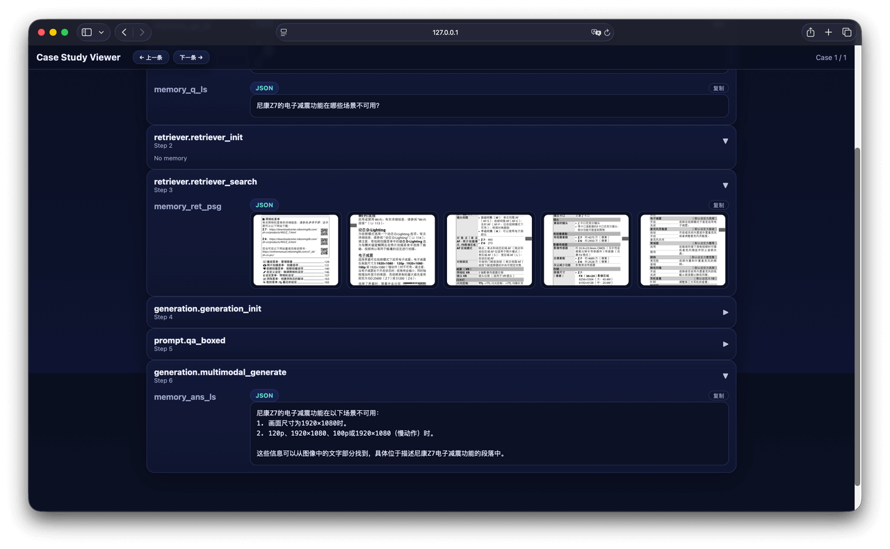

import { En, Zh } from '@site/src/components/Lang';

<En>

In the process of building knowledge bases, setting up experimental systems, and evaluating results, researchers always encounter similar challenges: How to achieve multimodal retrieval and generation within a unified framework? How to efficiently integrate multi-source knowledge? And how to make complex RAG experiments easier to build and reproduce?

**UltraRAG 2.1** addresses these research challenges with comprehensive upgrades focused on practical needs. This update brings core enhancements in three directions: **native multimodal support, automated knowledge integration and corpus construction, and unified build-and-evaluate RAG workflows**:

- **Native Multimodal Support**: Unified Retriever, Generation, and Evaluation modules with full multimodal retrieval and generation support; new **VisRAG Pipeline** enabling a complete closed-loop from local PDF indexing to multimodal retrieval and generation.
- **Automated Knowledge Integration & Corpus Construction**: Supports multi-format document parsing and chunked indexing, seamlessly integrating MinerU for easy construction of personalized knowledge bases.
- **Unified Build & Evaluate RAG Workflows**: Compatible with multiple retrieval and generation inference engines, providing a standardized evaluation system with full-chain visual analysis, achieving a unified process from model invocation to result verification.

## Native Multimodal Support

Previously, multimodal RAG often relied on multiple independent tools: text tasks and visual tasks belonged to different workflows, requiring researchers to switch between feature extraction, retrieval, generation, and evaluation tools, with inconsistent interfaces and difficult reproducibility.

**UltraRAG 2.1** systematically integrates the multimodal RAG pipeline. All core Servers — **Retriever, Generation, and Evaluation** — now natively support multimodal tasks and can flexibly connect to various visual, text, or cross-modal models. Researchers can freely orchestrate their own multimodal pipelines within the unified framework — whether for document QA, image-text retrieval, or cross-modal generation — all achievable with minimal effort for end-to-end integration. Additionally, the framework's built-in **Benchmarks** cover various tasks including visual QA, with a unified evaluation system for researchers to quickly conduct and compare multimodal experiments.

Building on this, **UltraRAG 2.1 introduces the VisRAG Pipeline**, enabling a complete closed-loop from local PDF indexing to multimodal retrieval and generation. This feature is based on the research in "VisRAG: Vision-based Retrieval-augmented Generation on Multi-modality Documents," which proposes a vision-enhanced retrieval-augmented generation framework for multimodal documents. By jointly modeling document image information (such as charts, formulas, layout structures) with text content, it significantly improves content understanding and QA capabilities for complex scientific documents. UltraRAG integrates this approach, enabling researchers to reproduce VisRAG experiments directly on real PDF document scenarios and further extend multimodal retrieval-generation research and applications.

## Automated Knowledge Integration & Corpus Construction

During RAG development, developers need to repeatedly parse, clean, and chunk materials from different sources. As a result, the RAG construction process is often slowed by trivial engineering details, compressing the space for research innovation.

**UltraRAG 2.1's** **Corpus Server** makes all of this simple. Users can import corpora from different sources in one go without writing complex scripts — whether Word documents, e-books, or web archives — all automatically parsed into a unified text format. For PDF parsing, UltraRAG seamlessly integrates **MinerU**, accurately recognizing complex layouts and multi-column structures for high-fidelity text restoration. For mixed image-text files, it also supports converting PDFs page-by-page to images, making visual layouts part of the knowledge. For chunking strategies, **Corpus Server** offers multi-granularity options: supporting token-level, sentence-level, and custom rules, enabling fine-grained control of semantic boundaries while naturally adapting to structured text like Markdown.

</En>

<Zh>

在研究者构建知识库、搭建实验系统、评估实验结果的过程中，总会遇到相似的挑战：如何在一个统一框架中实现多模态检索与生成？如何高效接入多源知识？又如何让复杂的 RAG 实验更易搭建、更易复现？

**UltraRAG 2.1** 在这些科研挑战的背景下，进行了面向实际研究需求的全面升级。本次更新围绕 **原生多模态支持、知识接入与语料构建自动化、统一构建与评估的 RAG 工作流** 三大方向带来了核心增强：

- **原生多模态支持**：统一 Retriever、Generation 与 Evaluation 模块，全面支持多模态检索与生成；新增 **VisRAG Pipeline**，实现从本地 PDF 建库到多模态检索与生成的完整闭环。
- **知识接入与语料构建自动化**：支持多格式文档解析与分块建库，无缝集成 MinerU，轻松构建个人化知识库。
- **统一构建与评估的 RAG 工作流**：适配多种检索与生成推理引擎，提供标准化的评估体系，支持全链路可视化分析，实现从模型调用到结果验证的统一流程。

## 原生多模态支持

过去，多模态 RAG 往往需要依赖多套独立工具：文本任务与视觉任务分属不同流程，研究者需在特征提取、检索、生成和评估工具间来回切换，接口不统一、复现困难。

**UltraRAG 2.1** 对多模态 RAG 流程进行了系统化整合。所有核心 Server——**Retriever、Generation 与 Evaluation**——均已原生支持多模态任务，可灵活接入各种视觉、文本、或跨模态模型。研究者可在统一框架内自由编排属于自己的多模态 pipeline，无论是文档问答、图文检索，还是跨模态生成，都能以最小代价实现端到端联通。此外，框架内置的 **Benchmark** 覆盖视觉问答等多种任务，并提供统一的评估体系，方便研究者快速开展和对比多模态实验。

在此基础上，**UltraRAG 2.1 引入 VisRAG Pipeline**，实现从本地 PDF 建库到多模态检索与生成的完整闭环。该功能基于论文《VisRAG: Vision-based Retrieval-augmented Generation on Multi-modality Documents》的研究成果，论文提出了一个面向多模态文档的视觉增强检索生成框架，通过将文档图像信息（如图表、公式、版面结构）与文本内容联合建模，显著提升了模型在复杂科学文档中的内容理解与问答能力。UltraRAG 将这一方法集成，使研究者能够直接在真实 PDF 文档场景中复现 VisRAG 的实验过程，并进一步扩展多模态检索生成的研究与应用。

## 知识接入与语料构建自动化

在 RAG 开发过程中，面对不同来源的资料，开发者需要反复解析、清洗、分块。结果是，RAG 的构建过程往往被琐碎的工程细节拖慢，科研创新的空间反而被压缩。

**UltraRAG 2.1** 的 **Corpus Server** 让这一切变得简单。用户无需编写复杂脚本，就能一次性导入来自不同来源的语料——无论是 word 文档还是电子书与网页存档，都能被自动解析为统一的文本格式。在 PDF 解析方面，UltraRAG 无缝集成 **MinerU**，能够精确识别复杂版面与多栏结构，实现高保真文本还原。对于图文混排文件，还支持将 PDF 按页转换为图像，让视觉布局也能成为知识的一部分。在分块策略上，**Corpus Server** 提供了多粒度选择：支持词元级、句子级与自定义规则，既能精细控制语义边界，又能自然适配 Markdown 等结构化文本。

</Zh>

<En>

Through this automated pipeline, Corpus Server modularizes the corpus import, parsing, and chunking process, reducing manual scripting and format adaptation work, enabling knowledge base construction to be directly integrated into the standardized RAG pipeline workflow.

## Unified Build & Evaluate RAG Workflows

> "Chunking, indexing, retrieval, generation, evaluation — each step requires different scripts, too cumbersome!"
"Every time I change a parameter or switch a model, do I need to rebuild the entire pipeline?"
"After the experiment finally runs, how do I keep evaluation results consistent and comparable?"

These questions are frustrations that almost every RAG researcher has experienced. Existing frameworks often provide fragmented and incompatible support for retrieval, model integration, and evaluation, forcing researchers to repeatedly switch between different tools, with every modification potentially triggering a rebuild of the entire experimental chain. UltraRAG 2.1's goal is to make complex workflows clear and unified again.

At the retrieval level, the framework supports sparse, dense, hybrid, and multimodal retrieval, compatible with multiple backend engines including Infinity, Sentence-Transformers, and OpenAI. Researchers can freely combine retrieval strategies and models for flexible pipeline design. For model generation, UltraRAG 2.1 simultaneously supports vLLM offline inference and Hugging Face local debugging, while maintaining full compatibility with the OpenAI interface, making model switching and deployment require no code changes. For evaluation, UltraRAG builds a unified Evaluation Server that can compute metrics like ACC and ROUGE for generated results, and supports TREC evaluation and significance analysis for retrieval results. Combined with the visual Case Study UI, researchers can intuitively compare the performance of different models and strategies, making "debugging" truly become "understanding."

Furthermore, UltraRAG achieves full-chain integration from data import to retrieval, generation, and evaluation through a YAML configuration-driven workflow mechanism. Researchers only need to write minimal configuration files to quickly define and reproduce experimental workflows.

</En>

<Zh>

通过这一整套自动化流程，Corpus Server 将语料导入、解析与分块过程模块化，减少了手工脚本与格式适配工作，使知识库构建可以直接融入 RAG pipeline 的标准化流程中。

## 统一构建与评估的 RAG 工作流

> "切块、索引、检索、生成、评估，每一步都要用不同的脚本，太繁琐了！"
"每改一次参数、换一个模型，是否又要重搭整条 pipeline？"
"当实验终于跑通后，评估结果又该怎样保持一致与可比？"

这些问题几乎是每个 RAG 研究者都经历过的烦恼。现有框架对检索、模型接入、评估的支持往往零散且不兼容，研究者不得不在不同工具之间反复切换，每一次修改都可能引发整条实验链路的重建。UltraRAG 2.1 的目标，就是让复杂的流程重新变得清晰而统一。

在检索层面，框架支持稀疏、稠密、混合与多模态检索，并兼容 Infinity、Sentence-Transformers、OpenAI 等多种后端引擎，研究者可以自由组合检索策略与模型，实现灵活的 pipeline 设计。在模型生成部分，UltraRAG 2.1 同时支持 vLLM 离线推理 与 Hugging Face 本地调试，并保持与 OpenAI 接口 完全兼容，使模型切换与部署无需修改代码。在评估环节，UltraRAG 构建了统一的 Evaluation Server，既能对生成结果计算 ACC、ROUGE 等指标，又支持对检索结果进行 TREC 评估与显著性分析。配合可视化的 Case Study UI，研究者可以直观地比较不同模型与策略的表现，让"调试"真正变成"理解"。

此外，UltraRAG 通过 YAML 配置驱动的工作流机制，实现了从数据导入到检索、生成与评估的全链路串联，研究者只需编写少量配置文件，即可快速定义和复现实验流程。

</Zh>

